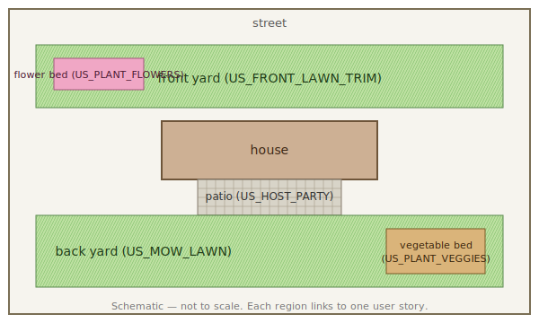

# pictures/public/

Diagrams shipped with the template.

| File                 | Purpose                                                       |
| -------------------- | ------------------------------------------------------------- |
| `garden_layout.svg`  | Schematic of the demo garden, used in the user-story pages.   |

Reference an image from any MyST page like this:

```markdown

```
